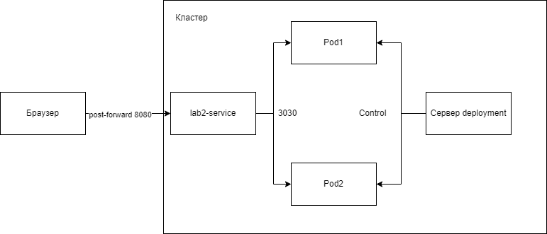

University: [ITMO University](https://itmo.ru/ru/)  
Faculty: [FICT](https://fict.itmo.ru)  
Course: [Introduction to distributed technologies](https://github.com/itmo-ict-faculty/introduction-to-distributed-technologies)  
Year: 2022/2023  
Group: K4110c  
Author: Orudzhev Eldar Eldarovich  
Lab: Lab2  
Date of create: 04.11.2022  
Date of finished: 10.11.2022  

# Ход работы
1) Скачивание образа  

Скачиваем образ контейнера с указанного в лабораторной работе сайта.  

   
 
 2) Манифест  
 
 Сделаем deployment манифест.    
 ```yaml
apiVersion: apps/v1
kind: Deployment
metadata:
  name: lab2
  labels:
    app: lab2
spec:
  replicas: 2
  selector:
    matchLabels:
      app: lab2
  template:
    metadata:
      labels:
        app: lab2
    spec:
      containers:
        - name: lab2
          image: ifilyaninitmo/itdt-contained-frontend:master
          ports:
            - containerPort: 3000
          env:
            - name: REACT_APP_USERNAME
              value: "Eldar"
            - name: REACT_APP_COMPANY_NAME
              value: "ITMO"
```
  
 
Теперь сделаем манифест для сервиса.  
 ```yaml
apiVersion: v1
kind: Service
metadata:
  name: lab2-service
spec:
  selector:
    app: lab2
  ports:
    - protocol: TCP
      port: 8080
      targetPort: 3000
```  
 

3) Открытие сервера

  

4) Логи

  

В ходе выполнения лабораторной работы были выполнены все задачи.  

5) Схема

 
