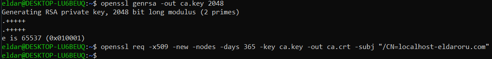
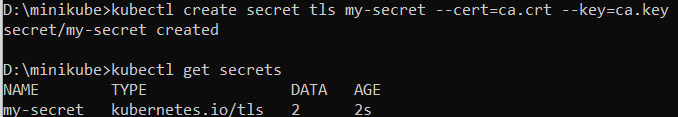
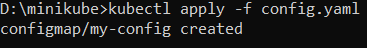
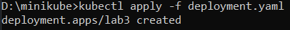
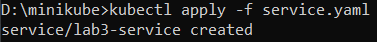
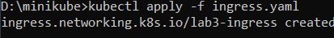
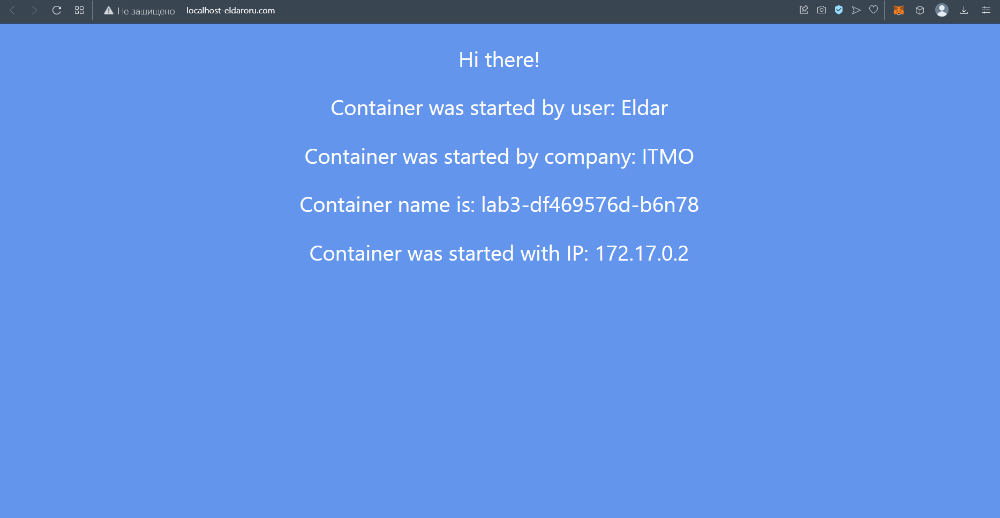
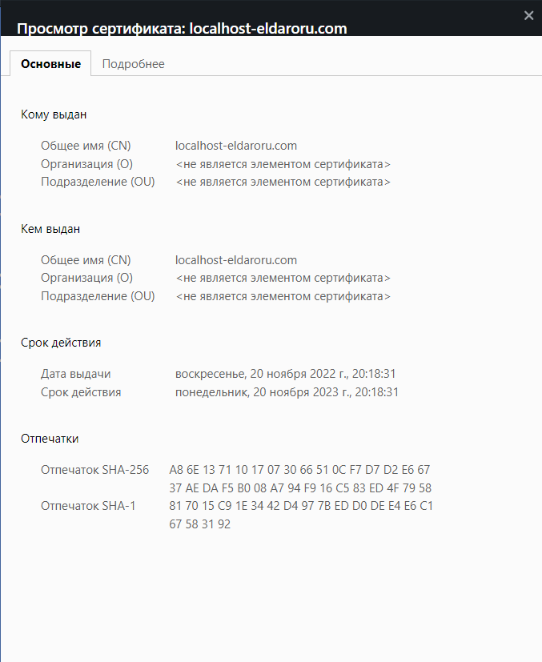
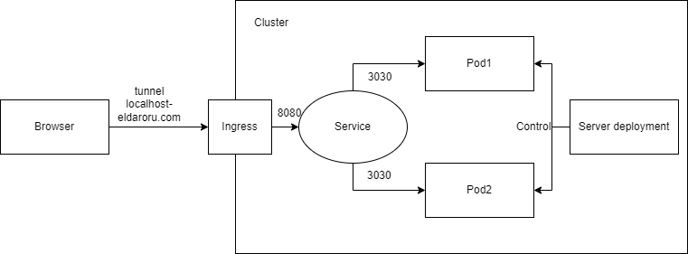

University: [ITMO University](https://itmo.ru/ru/)  
Faculty: [FICT](https://fict.itmo.ru)  
Course: [Introduction to distributed technologies](https://github.com/itmo-ict-faculty/introduction-to-distributed-technologies)  
Year: 2022/2023  
Group: K4110c  
Author: Orudzhev Eldar Eldarovich  
Lab: Lab3    
Date of create: 23.11.2022  
Date of finished: 24.11.2022  

# Ход работы
1) Создание сертификата  

Используя статью с [медиума](https://medium.com/avmconsulting-blog/how-to-secure-applications-on-kubernetes-ssl-tls-certificates-8f7f5751d788) создадим сертификат на линуксе.

   
 
 Следующей командой мы добавляем секрет в minikube
   
 
 2) Добавление аддонов  
 
 Для того, чтобы всё работало надо добавить аддоны с ingress  
 
 
 3) Создание манифестов  
 
 Далее нужно создать и заэплаить все нужные нам манифесты - config, deployment, service и ingress
 
Config:  
 ```yaml
apiVersion: v1
kind: ConfigMap
metadata:
  name: my-config
data:
  REACT_APP_USERNAME: Eldar
  REACT_APP_COMPANY_NAME: ITMO
```  
  

Deployment:  
 ```yaml
apiVersion: apps/v1
kind: Deployment
metadata:
  name: lab3
  labels:
    app: lab3
spec:
  replicas: 2
  selector:
    matchLabels:
      app: lab3
  template:
    metadata:
      labels:
        app: lab3
    spec:
      containers:
        - name: lab3
          image: ifilyaninitmo/itdt-contained-frontend:master
          ports:
            - containerPort: 3000
          envFrom:
            - configMapRef:
                name: my-config
```  
  

Service:  
 ```yaml
apiVersion: v1
kind: Service
metadata:
  name: lab3-service
spec:
  selector:
    app: lab3
  ports:
    - protocol: TCP
      port: 8080
      targetPort: 3000
```  
  

Ingress:  
 ```yaml
apiVersion: networking.k8s.io/v1
kind: Ingress
metadata:
  name: lab3-ingress
spec:
  rules:
    - host: localhost-eldaroru.com
      http:
        paths:
          - backend:
              service:
                name: lab3-service
                port:
                  number: 8080
            path: /
            pathType: Prefix
  tls:
    - hosts:
        - localhost-eldaroru.com
      secretName: my-secret
```  
  

4) Запускаем  

С помощью команды minikube tunnel запускаем сервис  

  
Как мы видим имя домейна поменялось  

  
Также есть данные о сертификате  



В ходе выполнения лабораторной работы были выполнены все задачи

