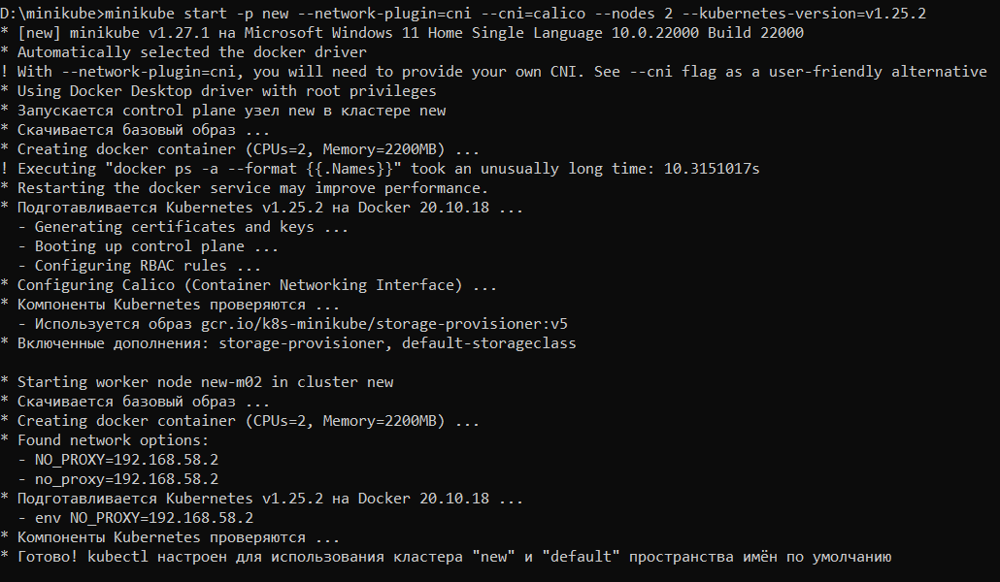
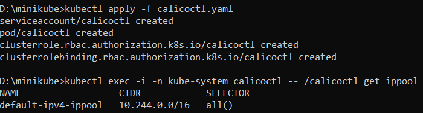
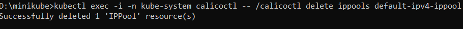
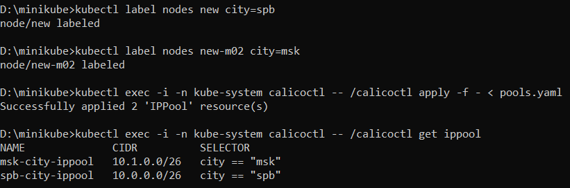
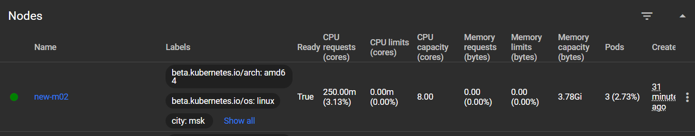
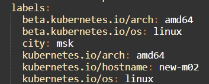
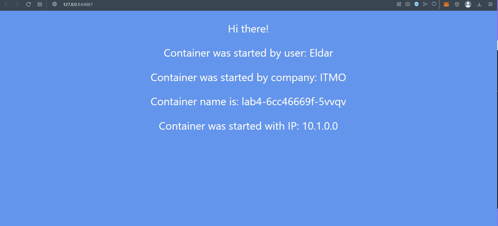
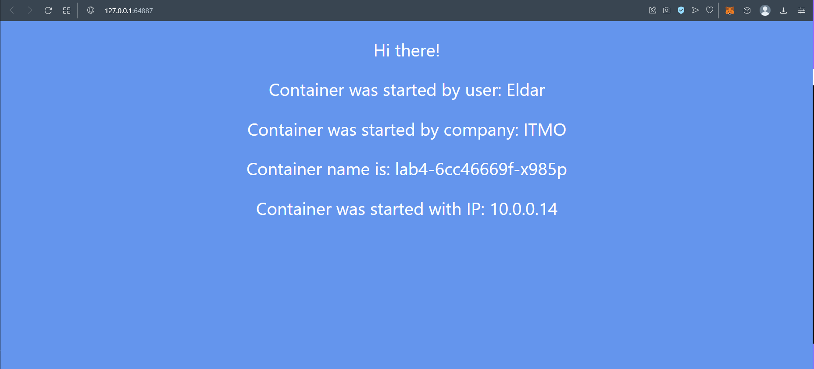
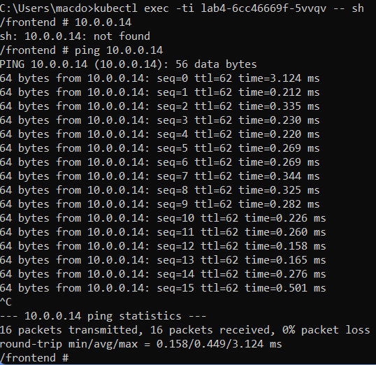
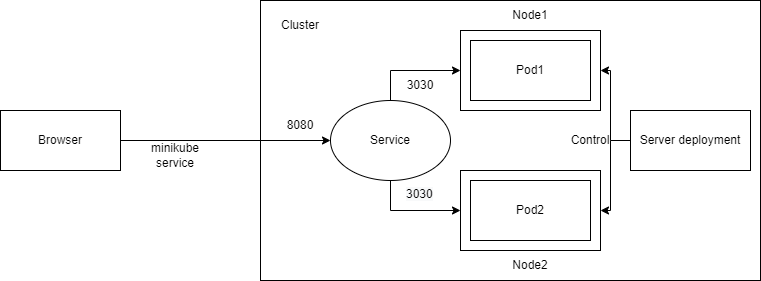

University: [ITMO University](https://itmo.ru/ru/)  
Faculty: [FICT](https://fict.itmo.ru)  
Course: [Introduction to distributed technologies](https://github.com/itmo-ict-faculty/introduction-to-distributed-technologies)  
Year: 2022/2023  
Group: K4110c  
Author: Orudzhev Eldar Eldarovich  
Lab: Lab4      
Date of create: 23.11.2022  
Date of finished: 24.11.2022  

# Ход работы
1) Создание кластера  

Для начала нам нужно создать кластер с двумя нодами
  

2) Calico  

Теперь заэплаим манифест с Calico, сам манифест возьмем [отсюда](https://raw.githubusercontent.com/projectcalico/calico/v3.24.5/manifests/calicoctl.yaml)  
  

3) Удаление дефолтного IP Pool  

  

4) Создание IP Pools  

Манифест для IP Pools возьмет [тут](https://projectcalico.docs.tigera.io/reference/resources/ippool)  
 ```yaml
apiVersion: projectcalico.org/v3
kind: IPPool
metadata:
  name: spb-city-ippool
spec:
  cidr: 10.0.0.0/26
  ipipMode: Always
  natOutgoing: true
  nodeSelector: city == "spb"

---
apiVersion: projectcalico.org/v3
kind: IPPool
metadata:
  name: msk-city-ippool
spec:
  cidr: 10.1.0.0/26
  ipipMode: Always
  natOutgoing: true
  nodeSelector: city == "msk"
```  

5) Labels для нод  

Добавим label для нод по географическому признаку  
  

6) Service, deployment, config  

Service: Манифест для service возьмем из прошлой работы  
 ```yaml
apiVersion: v1
kind: Service
metadata:
  name: lab4-service
spec:
  selector:
    app: lab4
  ports:
    - protocol: TCP
      port: 8080
      targetPort: 3000
```  
Deployment: Манифест для deployment будет выглядеть следующим образом  
 ```yaml
apiVersion: apps/v1
kind: Deployment
metadata:
  name: lab4
  labels:
    app: lab4
spec:
  replicas: 2
  selector:
    matchLabels:
      app: lab4
  template:
    metadata:
      labels:
        app: lab4
    spec:
      containers:
        - name: lab4
          image: ifilyaninitmo/itdt-contained-frontend:master
          ports:
            - containerPort: 3000
          envFrom:
            - configMapRef:
                name: my-config
      affinity:
        podAntiAffinity:
          requiredDuringSchedulingIgnoredDuringExecution:
            - labelSelector:
                matchExpressions:
                  - key: app
                    operator: In
                    values:
                      - lab4
              topologyKey: "kubernetes.io/hostname"
```  
Изучив [статью](https://habr.com/ru/company/otus/blog/576944/), в манифест был добавлен блок с affinity-правилом  

Config: Для config возьмем манифест из прошлой работы  
```
apiVersion: v1
kind: ConfigMap
metadata:
  name: my-config
data:
  REACT_APP_USERNAME: Eldar
  REACT_APP_COMPANY_NAME: ITMO
  ```  
  
7) Запуск  

Запуск производится командой minikube -p new service lab4-service  
И первый запуск был неудачным - почему-то не менялся под  
Зайдя на dashboard, я увидел, что, действительно, работает только один под из двух  
Проведя анализ, было выяснено, что у одной из нод отсутствовал label city: msk  
  
Пришлось добавлять его вручную  
  
После этого я удалил и снова заэплаил deployment и всё заработало  
  
  

Также попингуем поды  
  

Лабораторная работа выполнена  
  


